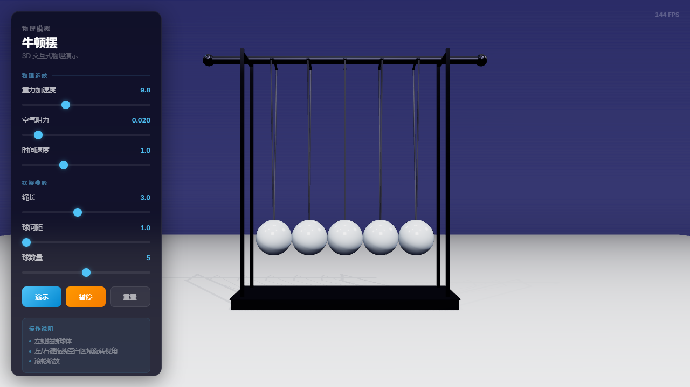

# Newton's Cradle 3D Simulation

一个基于 HTML5 Canvas 的牛顿摆（Newton's Cradle）3D 物理模拟演示。

## 在线预览

- **GitHub Pages**：https://aixineiar.github.io/newton-cradle-demo/
- 或直接在浏览器中打开 `newton-cradle.html`，无需任何依赖或编译



## 功能特性

- **3D 物理模拟**：实时计算摆球运动、碰撞与能量传递
- **交互式控制面板**：可调节物理参数，观察不同条件下的运动效果
- **响应式设计**：自适应窗口大小，支持桌面与移动端浏览
- **纯前端实现**：单文件 HTML，零依赖，开箱即用

## 使用方法

1. 克隆仓库
   ```bash
   git clone https://github.com/Aixineiar/newton-cradle-demo.git
   ```
2. 用浏览器打开 `newton-cradle.html`
3. 在左侧控制面板调整参数，拖拽摆球进行交互

## 技术栈

- HTML5 Canvas
- Vanilla JavaScript（原生 JS，无框架依赖）
- CSS3 动画与毛玻璃效果

## 项目结构

```
.
├── newton-cradle.html   # 主程序（包含 HTML/CSS/JS）
├── screenshot.png       # 预览截图
└── README.md            # 项目说明
```

## 开源协议

MIT License
